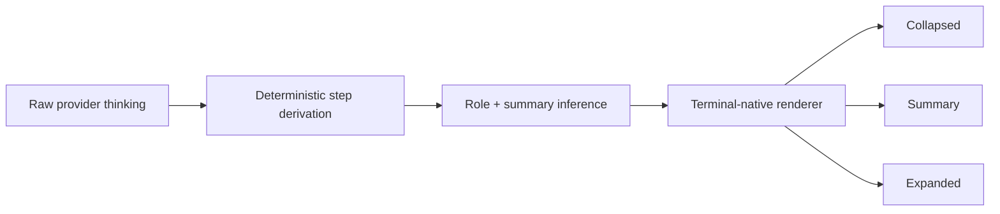
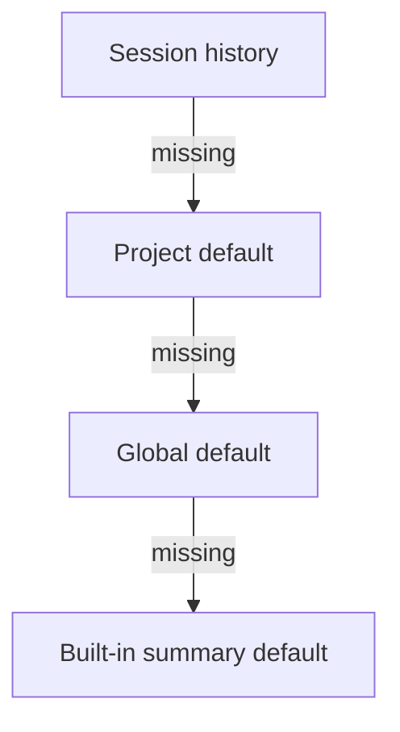
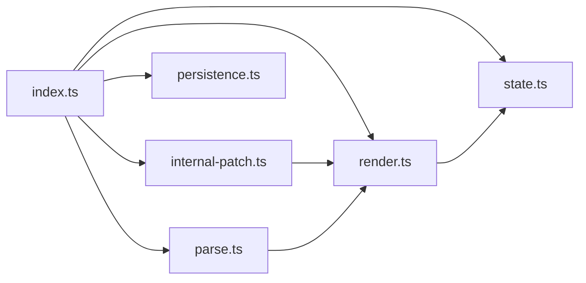

# Pi Thinking Steps

<p align="center">
  <strong>A polished, terminal-native thinking view for Pi.</strong><br />
  Turn raw provider reasoning into something you can actually scan while it streams.
</p>

<p align="center">
  <a href="https://github.com/fluxgear/pi-thinking-steps/tags"></a>
  <a href="./LICENSE"></a>
  
  
</p>

---

## Why this exists

Pi already exposes provider thinking, but the default presentation is intentionally minimal. That is fine for occasional inspection, but weak when you want to:

- understand what the model is doing right now
- scan a long reasoning trace without losing the thread
- review steps quickly before trusting an answer
- see headings, lists, code spans, and emphasis rendered more cleanly
- keep the UI compact until you need the full detail

**Pi Thinking Steps** improves readability **without changing the meaning of the source text**.

---

## At a glance

- **Three stable modes** — `collapsed`, `summary`, `expanded`
- **Live terminal UI** — compact while thinking is streaming, detailed when you need it
- **Faithful parsing** — no invented reasoning, no synthetic meaning
- **Markdown-aware rendering** — headings, lists, code spans, emphasis markers
- **Scoped persistence** — session, project, and global defaults
- **Patch safety** — isolated, reversible, reference-counted runtime patching
- **Regression coverage** — parser, renderer, lifecycle, and compatibility tests

---

## How it works



The extension keeps the pipeline narrow on purpose:
- parse the provider text into faithful step boundaries
- summarize those steps conservatively
- render them in a terminal-first format that stays readable under real width constraints

---

## Display modes

### `collapsed`
Shows a single compact line for the active thinking step.

Best when you want minimal visual noise while still seeing what the model is actively working on.

### `summary`
Shows one summarized line per derived thinking step.

Best when you want a fast overview of the reasoning flow.

### `expanded`
Shows the full derived steps with body text and connected terminal flow styling.

Best when you want the complete reasoning text, but rendered more cleanly than raw transcript output.

---

## Control surface

| Action | Control |
|---|---|
| Cycle thinking view | `Alt+T` |
| Choose a mode interactively | `/thinking-steps` |
| Set collapsed mode for this session | `/thinking-steps collapsed` |
| Set summary mode for this session | `/thinking-steps summary` |
| Set expanded mode for this session | `/thinking-steps expanded` |
| Save a project default | `/thinking-steps project expanded` |
| Save a global default | `/thinking-steps global summary` |
| Clear a project default | `/thinking-steps project clear` |
| Clear a global default | `/thinking-steps global clear` |

---

## Persistence model

Thinking Steps restores the active mode in this order:

1. last mode saved in the current session
2. project default from `.pi/thinking-steps.json`
3. global default from `~/.pi/agent/state/thinking-steps.json`
4. built-in default `summary`



Use `/thinking-steps <mode>` when the choice should stay local to the current session. Use `project` or `global` when you want future sessions to inherit the same default automatically.

---

## Example output

### Summary mode

```text
┆ Thinking Steps · Summary
├─ ◫ Inspect the current renderer implementation.
├─ ↔ Compare how visibility toggling works.
└─ ✓ Verify the refresh path after mode changes.
```

### Expanded mode

```text
┆ Thinking Steps · Expanded
├─ ◫ Inspect the current renderer implementation.
│  Inspect the current renderer implementation.
├─ ↔ Compare how visibility toggling works.
│  Compare how visibility toggling works.
└─ ✓ Verify the refresh path after mode changes.
   Verify the refresh path after mode changes.
```

### Collapsed mode

```text
│ Thinking ✓ Verify the refresh path after mode changes. ·
```

---

## Rendering behavior

Pi Thinking Steps is intentionally conservative: it improves readability **without inventing new meaning**.

### Parsing and step derivation

It derives steps from provider thinking text using deterministic rules so output stays faithful to the original text.

Examples:

- standalone markdown headings stay attached to the body they introduce
- list items become separate steps when that improves scanability
- blank-line continuation paragraphs stay attached to the correct list item
- redacted reasoning remains clearly marked as provider-hidden

### Display formatting

The renderer normalizes markdown-like content for terminal display:

- headings render as headings instead of raw `#` clutter
- list items render with clean bullets
- backticks render as code-styled inline text
- emphasis markers render cleanly instead of leaking raw `*...*` / `_..._`
- raw control sequences from model output are stripped before rendering

### Terminal-first constraints

This extension is built for a real terminal, not a web UI. That means:

- width-aware line wrapping matters
- ANSI-safe rendering matters
- over-decoration is avoided
- the output should remain useful in narrower layouts

---

## Technical approach

Pi currently exposes only a minimal public hook for built-in thinking rendering: `setHiddenThinkingLabel`.

Because of that limitation, this extension patches Pi's internal `AssistantMessageComponent` at runtime and replaces the default visible thinking rendering path with a custom structured renderer.

That patch layer is designed to be:

- **isolated** — runtime patching lives in `internal-patch.ts`
- **reversible** — cleanup restores original methods
- **reference-counted** — multiple retain/release paths are handled safely
- **guarded** — compatibility checks fail loudly when Pi internals drift
- **tested** — integration and regression tests cover patch lifecycle and rendering edge cases



---

## Quick start

From the repository root:

```bash
pi -e ./index.ts
```

You can also load this repository as a Pi extension package through your normal Pi setup.

The package entry point is already configured in `package.json`:

```json
"pi": {
  "extensions": ["./index.ts"]
}
```

---

## Compatibility note

This project intentionally depends on Pi's current internal TUI implementation.

That means:

- upstream Pi internal changes can break the patch layer
- keeping this extension in sync with Pi releases matters
- Pi package upgrades should be deliberate compatibility changes: update the pinned versions, refresh `package-lock.json`, and rerun `npm test`
- the test suite is part of the maintenance contract, not an optional extra

If Pi changes its internal renderer shape, this extension may need updates even if the public Pi CLI still works normally.

---

## Development

Install dependencies:

```bash
npm install
```

Run the full validation suite:

```bash
npm test
```

Typecheck only:

```bash
npm run build
```

---

## Project structure

- `index.ts` — extension entry point, commands, shortcut, lifecycle hooks
- `internal-patch.ts` — Pi runtime patching and cleanup
- `parse.ts` — thinking-step splitting, summaries, role inference, mode parsing
- `persistence.ts` — project/global mode preference storage
- `render.ts` — collapsed / summary / expanded terminal rendering
- `state.ts` — shared mode, active-thinking state, patch lifecycle state
- `types.ts` — shared contracts
- `test/thinking-steps.test.ts` — unit and integration coverage

---

## Design principles

1. **Terminal-first over decorative**
   - The goal is readability, not flashy formatting.

2. **Faithful over clever**
   - The renderer should not invent structure the source text does not support.

3. **Small surface area**
   - Parsing, rendering, state, and patching are kept separated on purpose.

4. **Strict validation**
   - Changes should be backed by tests, especially around patch lifecycle and upstream-sensitive behavior.

---

## Versioning

For the canonical package version, see [`package.json`](./package.json).
For release points, use the repository tags.

---

## License

This project is released under the [MIT License](./LICENSE).
