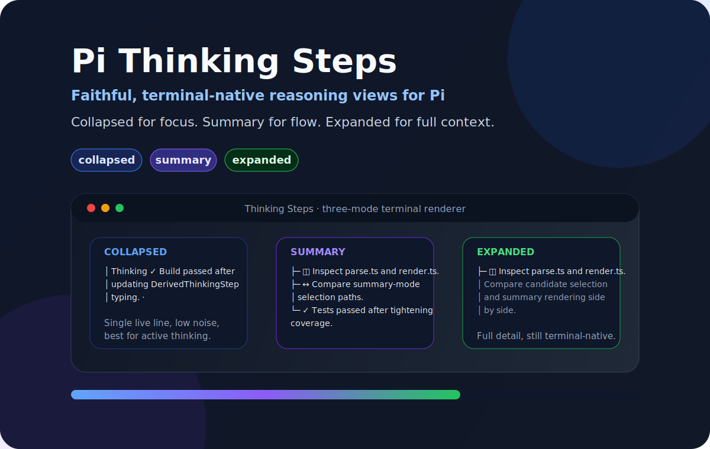
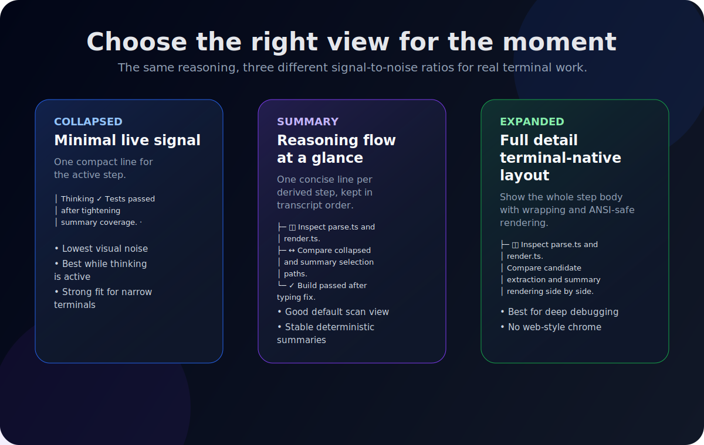

# Pi Thinking Steps

<div align="center">
  
</div>

<p align="center">
  <strong>Faithful, terminal-native thinking visualization for Pi.</strong><br />
  Turn raw provider reasoning into a clean, structured TUI view without changing what it means.
</p>

<p align="center">
  <a href="https://github.com/fluxgear/pi-thinking-steps/releases/tag/v1.0.6"></a>
  <a href="./LICENSE"></a>
  
  
</p>

---

## Why this exists

Pi already exposes provider thinking, but raw reasoning streams are hard to scan in a real terminal. Pi Thinking Steps keeps the source text faithful while making it dramatically easier to follow:

- less visual noise while a model is still thinking
- more structure when you want the reasoning flow at a glance
- cleaner full-detail rendering when you need to inspect the exact text
- no invented reasoning, synthetic logic, or browser-style chrome

The goal is simple: **preserve meaning, improve readability, and stay native to Pi's TUI.**

---

## Visual tour

<div align="center">
  
</div>

---

## What you get

- **Three focused modes** — `collapsed`, `summary`, `expanded`
- **Terminal-first rendering** — width-aware, ANSI-safe, and live-update friendly
- **Faithful parsing** — deterministic step derivation and restrained summarization
- **Markdown-aware output** — headings, bullets, ordered lists, code spans, and emphasis render cleanly
- **Scoped persistence** — session, project, and global defaults with predictable restore precedence
- **Patch safety** — isolated, reversible, reference-counted runtime patching
- **Regression coverage** — parser, renderer, lifecycle, compatibility, and metadata checks

---

## The three modes

| Mode | Best for | Behavior |
|---|---|---|
| `collapsed` | Live active thinking | Shows a single compact line for the highest-signal active step |
| `summary` | Flow at a glance | Shows one summarized line per derived step in chronological order |
| `expanded` | Deep inspection | Shows the full step text in a cleaner, structured terminal layout |

### `collapsed`
Use it when you want the smallest possible thinking footprint while the model is still working.

### `summary`
Use it when you want to understand the reasoning path quickly without reading the full transcript.

### `expanded`
Use it when you want the whole text, but formatted for a terminal instead of dumped as a raw stream.

---

## Control surface

| Action | Control |
|---|---|
| Cycle thinking view | `Alt+T` |
| Choose a mode interactively | `/thinking-steps` |
| Set session mode | `/thinking-steps collapsed` / `summary` / `expanded` |
| Save a project default | `/thinking-steps project <mode>` |
| Save a global default | `/thinking-steps global <mode>` |
| Clear a project default | `/thinking-steps project clear` |
| Clear a global default | `/thinking-steps global clear` |

---

## Persistence and restore precedence

Mode restoration follows this order:

1. session history
2. project default from `.pi/thinking-steps.json`
3. global default from `~/.pi/agent/state/thinking-steps.json`
4. built-in default `summary`

Use plain `/thinking-steps <mode>` when the choice should stay local to the current session. Use `project` or `global` when you want future sessions to inherit that choice automatically.

---

## Example output

### Summary

```text
┆ Thinking Steps · Summary
├─ ◫ Inspect the current renderer implementation.
├─ ↔ Compare how visibility toggling works.
└─ ✓ Verify the refresh path after mode changes.
```

### Expanded

```text
┆ Thinking Steps · Expanded
├─ ◫ Inspect the current renderer implementation.
│  Inspect the current renderer implementation.
├─ ↔ Compare how visibility toggling works.
│  Compare how visibility toggling works.
└─ ✓ Verify the refresh path after mode changes.
   Verify the refresh path after mode changes.
```

### Collapsed

```text
│ Thinking ✓ Verify the refresh path after mode changes. ·
```

---

## Rendering behavior

Pi Thinking Steps is built to improve readability **without changing meaning**.

### Parsing and step derivation

The parser uses deterministic rules to keep step boundaries believable and stable. Examples:

- standalone markdown headings stay attached to the body they introduce
- list items split into separate steps when that improves scanability
- blank-line continuation paragraphs stay attached to the correct list item
- standalone concluding prose after a list stays separate from the final list item
- provider-hidden reasoning remains clearly marked as hidden

### Display formatting

The renderer normalizes markdown-like content for terminal display:

- headings render as headings instead of leaking raw `#` markers
- unordered list items render with clean bullets
- ordered and lettered list markers are preserved
- backticks render as code-styled inline text
- emphasis markers render cleanly instead of leaking raw `*...*` / `_..._`
- raw control sequences from model output are stripped before rendering

### Terminal-first constraints

This extension is designed for a real terminal, not a browser UI. That means:

- width-aware wrapping matters
- ANSI-safe rendering matters
- over-decoration is intentionally avoided in the live TUI
- the output should remain readable in narrow layouts

---

## Technical approach

Pi currently exposes only a minimal public hook for built-in thinking rendering: `setHiddenThinkingLabel`.

To deliver a full three-mode thinking view, Pi Thinking Steps patches Pi's internal `AssistantMessageComponent` at runtime and replaces the default visible thinking rendering path with a custom renderer.

That patch layer is:

- **isolated** — patching lives in `internal-patch.ts`
- **reversible** — cleanup restores original methods
- **reference-counted** — multiple retain/release paths are handled safely
- **guarded** — compatibility checks fail loudly when Pi internals drift
- **tested** — integration and regression coverage protects the patch lifecycle

---

## Compatibility contract

This extension intentionally depends on Pi's current internal TUI implementation.

Today, the patch relies on these internal modules in `@mariozechner/pi-coding-agent`:

- `dist/modes/interactive/components/assistant-message.js`
- `dist/modes/interactive/theme/theme.js`

That means:

- upstream Pi internal changes can break the patch layer
- Pi upgrades should be treated as deliberate compatibility work
- the pinned Pi package versions and `package-lock.json` matter
- `npm test` is part of the maintenance contract, not an optional extra

The current package is pinned to Pi package version `0.69.0` in `package.json`.

---

## Quick start

From the repository root:

```bash
pi -e ./index.ts
```

The package entry point is already configured in `package.json`:

```json
"pi": {
  "extensions": ["./index.ts"]
}
```

---

## Development

Install dependencies:

```bash
npm install
```

Run the full validation suite:

```bash
npm test
```

Typecheck only:

```bash
npm run build
```

---

## Published package contents

The package ships:

- `README.md`
- `LICENSE`
- the extension TypeScript sources
- the README SVG assets under `assets/`

That keeps the GitHub README and the published package presentation aligned.

---

## Project structure

- `index.ts` — extension entry point, commands, shortcut, lifecycle hooks
- `internal-patch.ts` — Pi runtime patching and cleanup
- `parse.ts` — thinking-step splitting, summaries, role inference, mode parsing
- `persistence.ts` — project/global mode preference storage
- `render.ts` — collapsed, summary, and expanded terminal rendering
- `state.ts` — shared mode, active-thinking state, patch lifecycle state
- `types.ts` — shared contracts
- `test/thinking-steps.test.ts` — unit and integration coverage
- `test/summarizer-challenger.test.ts` — focused summarizer-regression coverage

---

## Design principles

1. **Readable over flashy**
   - The goal is clarity, not decoration.

2. **Faithful over clever**
   - The renderer should not invent meaning the source text does not support.

3. **Terminal-native over web-like**
   - The output should feel right in a terminal first.

4. **Small surface area**
   - Parsing, rendering, state, and patching stay deliberately separated.

5. **Strict validation**
   - Changes should be backed by tests, especially around patch lifecycle and compatibility.

---

## Versioning

For the canonical package version, see [`package.json`](./package.json). For release points, use the repository tags.

---

## License

This project is released under the [MIT License](./LICENSE).
